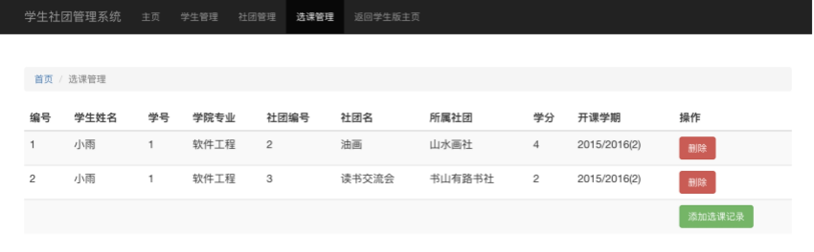

学生社团管理系统的设计与实现

Student Community Management

随着我国高等教育体制改革的深入，学生社团这一系统的应用已经成为各个大学必不可少的风景之一。学生社团是高等学校校园文化的重要载体，是高等学校第二课堂的重要组成部分。优化学生社团管理，充分发挥社团自身所具有的多样性、灵活性的优势，对于创建新型校园文化，促进学生全面发展具有重要意义。为此，我们应用Java技术和采用MYSQL数据库系统开发了基于B/S模式社团管理系统这一程序。它运用方便、操作简单，率很高。借助B/S模式，我们可以方便的浏览社团的各种信息，并可根据自身的需要参加各种活动，加强了大家与社团的联系，可以取得较好的社会效益。

课题开发的是学生社团信息管理系统，系统的开发要根据我们实际调研中的需求来进行开发，系统最基本的信息应该包括社团的信息、社员的基本信息、并且可以对两者的信息进行修改和添加等。

经过前期的需求调研和需求分析，我们可以确定学生社团管理系统主要分为三个部分：管理员页面、会员用户页面、游客页面。

本系统有两个权限，即会员权限，系统管理员权限。

会员权限可以注册用户，进行留言和修改密码，修改个人信息。 

系统管理员可以管理用户管理，社团管理，选课管理。

根据上述的功能模块，我们可以得到本系统的功能模块图。系统功能模块结构图

系统功能模块划分

 管理员登录

管理员登录主要验证的是管理员的用户名、密码的正确性，页面会将管理员输入的数据通过相应的SP进行逻辑处理，然后是数据库中的数据进行匹配。实现界面如下图所示：

个人社团管理主要包括已创造的社团登录和删除、已创造的社团信息的阅览功能。实现界面如下图所示：

社团管理主要包括用户信息的更新和删除、添加新社团功能。实现界面如下图所示：

 

选课管理主要包括选课信息删除、添加选课功能。实现界面如下图所示：

 

会员模块主要是修改已注册的用户信息；个人社团管理。

\- 个人信息修改

 

用户管理主要包括用户信息的更新和删除、添加用户功能。实现界面如下图所示：

